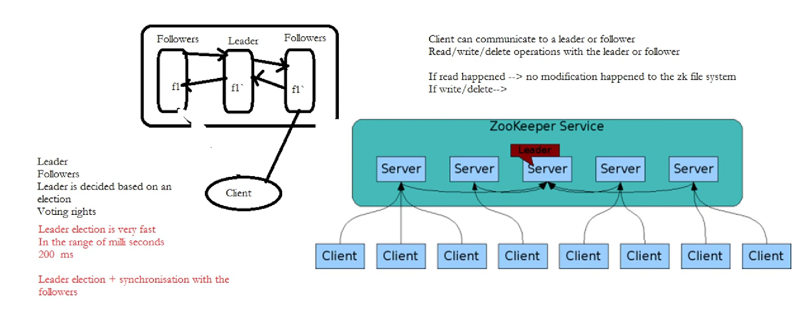
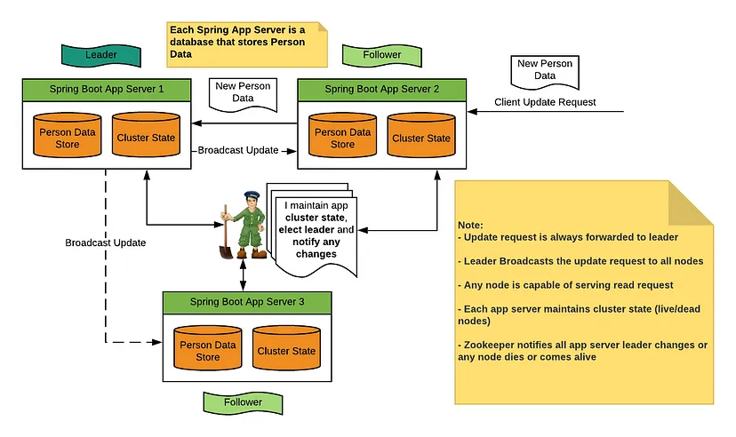

#### Leader Selection Algorithm means:

- What if master fail in master slave architecture ?
- Then we need to select a leader from the slave , that algorithm used for this is called leader selection algorithm.
- Bully and Ring Algorithm — designed for different distributed system configuration ( check when require ).

- https://3ev.medium.com/election-algorithm-a-case-study-7f51a4b059e9#:~:text=the%20Bully%20Algorithm.-,Bully%20Algorithm,from%20a%20set%20of%20processes.

#### Zookeeper 

- ZooKeeper is a distributed, open-source coordination service for distributed applications.
- Used in master-slave.
- Zookeeper internally use tree like structure like file system, and node is called znode.
- Znodes in ZooKeeper offer the ability to store data and have children, maintain metadata like version and transaction ID, support Access Control Lists (ACL) for permissions, including username/password authentication, and provide notification for any changes.
- This is the guy who responsible for selecting leader with some leader selection algorithms and other duties.[ Configuration management, Locks in distributed systems,  Maintain and detect if any server leaves or joins a cluster and store other complex information of a cluster]
- this is also have cluster with replication , to avoid SPOF of this service.
- inside cluster it also has leader ( based on voting ) and follower.
- client can connect to leader or follower for delete/write/read. if it comes to follower, it will tell to leader and will broadcast to all follower.
-  
- zookeeper vs normal key-store. ( why kafka used this instead of any other key-value store) [ to be honest don't know ]
- quote: "You're comparing the high-level data model of ZooKeeper to other key value stores, but that's not what makes it unique. From a distributed systems standpoint, ZooKeeper is different than many other key value stores (especially Redis) because it is strongly consistent and can tolerate failures while a majority of the cluster is connected. Additionally, while data is held in memory, it's synchronously replicated to a majority of the cluster and backed by disk, so once a write succeeds, it guarantees that write will not be lost (barring a missile strike). This makes ZooKeeper very useful for storing small amounts of mission critical state like configurations."
- 

- https://www.youtube.com/watch?v=0auBXKcMyUs&t=1659s
- https://bikas-katwal.medium.com/zookeeper-introduction-designing-a-distributed-system-using-zookeeper-and-java-7f1b108e236e
- https://stackoverflow.com/questions/31460901/whats-the-difference-between-zookeeper-and-any-distributed-key-value-stores

#### Raft
- This is consensus algorithm [ what ? -> [Link](https://www.notion.so/Distributed-consensus-63b85ade896c4e49ade80ac361690953) ]
- Used in multi-master , master-master.
- 
- https://medium.com/coccoc-engineering-blog/raft-consensus-algorithms-b48bb88afb17

#### Paxos

- Used in multi-master , master-master.
- 
