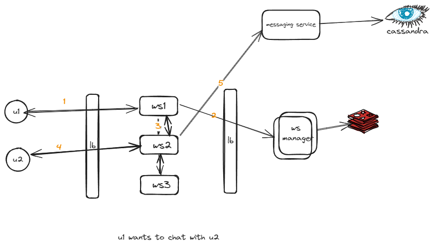
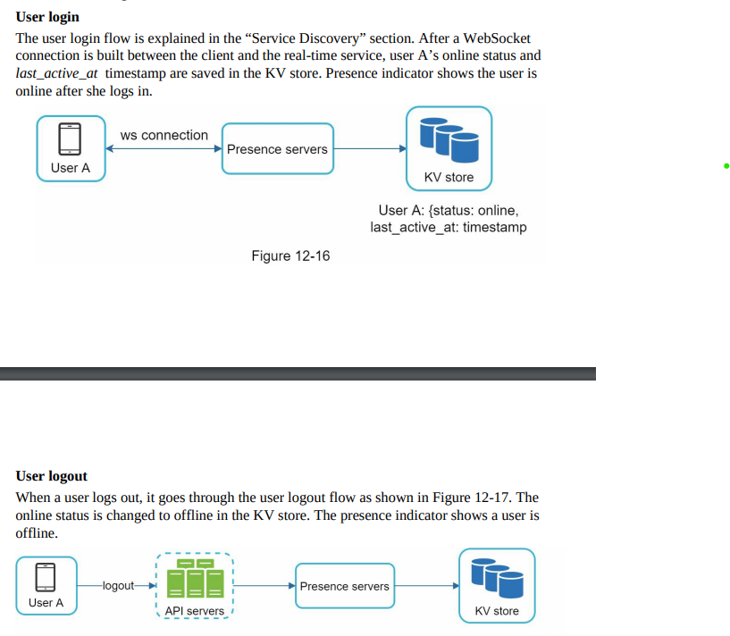
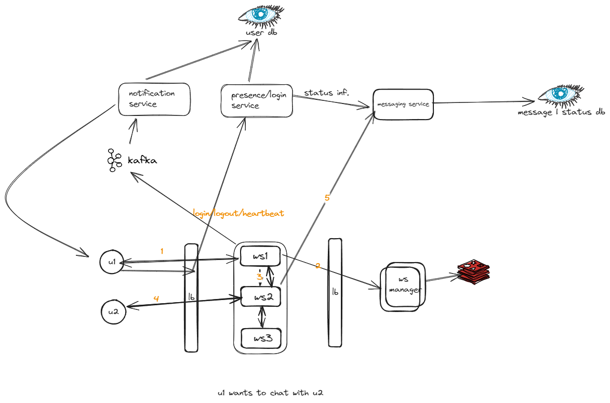
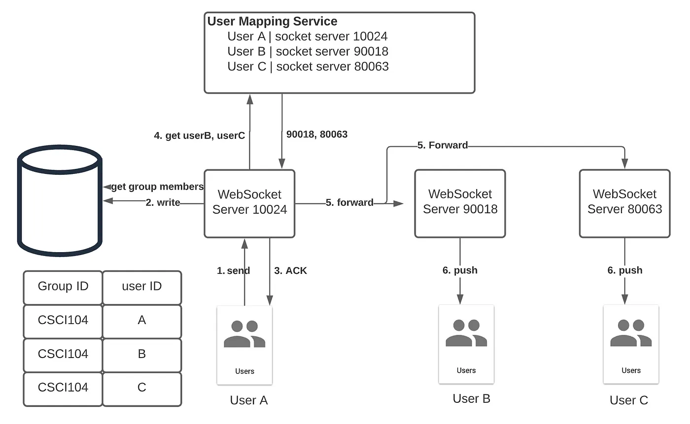
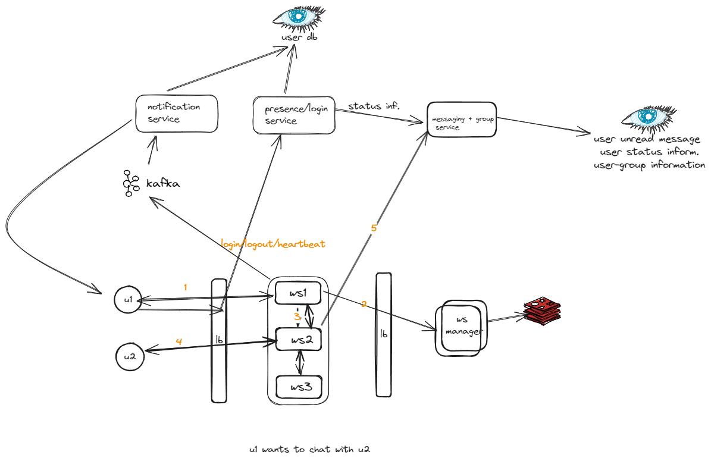
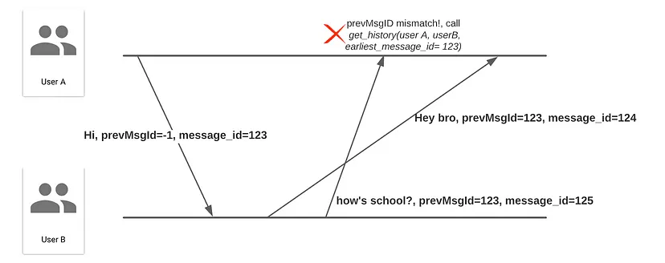
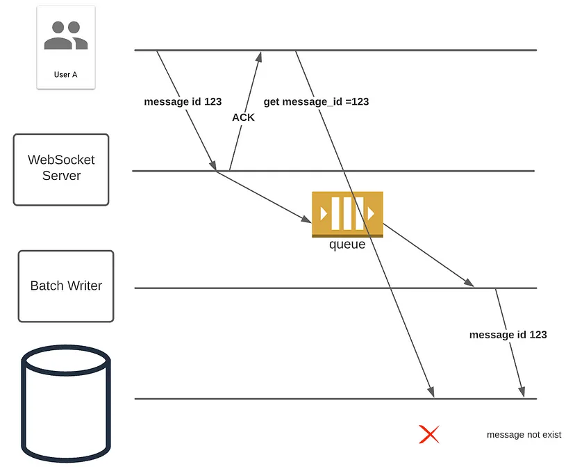
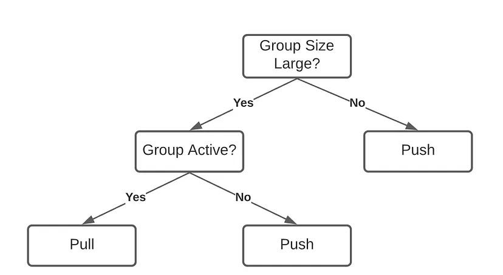

Design chat system:

#### Functional requirements
1. Should support one-on-one chat.
2. Group chats (max 100 people).
3. Should support file sharing (image, video, etc.).
4. Sent, Delivered, and Read receipts of the messages.
5. Show the last seen time of users.
6. If message is delivered don't keep it.
7. Push notifications.

#### Non-functional requirements

1. High availability with minimal latency.
2. The system should be scalable and efficient.

#### Design

#### What is web socket handler ? 

How will you find which user connected to which service in scaled system ? 

A web socket handler will be connected to a Web Socket Manager which is a repository of information about which web socket handlers are connected to which users. It sits on top of a Redis which stores two types of information:

- Which user is connected to which web socket handler
- What all users are connected to a web socket handler

Now let us get back to the conversation U1 and U2 are having. As we can see from the architecture flow diagram, U1 is connected to the web socket handler WSH1. So when U1 decides to send a message to U2, it communicates this to WSH1. WSH1 will then talk to the web socket manager to find out which web socket handler is handling U2, and the web socket manager will respond that U2 is connected to WSH2

#### What is message service.

this is for managing user status information and handling message when user is offline.
One user is online and message is deliver it will deleted data from db.

So if user is offline web socket server will call the messaging service and tell them to save message temporarily.
One user if online [ how will get to know ? Later]. Then will ask messaging service to get that message and delete.

#### How will get to know if user is online or not ? .

To implement the last seen functionality, we can use a heartbeat mechanism, where the client can periodically ping the servers indicating its liveness.
Since this needs to be as low overhead as possible, we can store the last active timestamp in the cache as follows: 

Key	Value

| User   | Date and Time           |
|--------|-------------------------|
| User A | 2022-07-01T14:32:50    |
| User B | 2022-07-05T05:10:35    |
| User C | 2022-07-10T04:33:25    |

#### Push Notification

This is little simple, our web socket will send the events to notification service kafka
one they received message from any user.

#### Group chat 

when request comes to ws service of a group message, then its connect to messaging service to get information about users in group.
after that it connects to web socket manager to get information about ws servers and then sends the message to user.

 

References:
1. System design by Alex xu.
2. https://www.youtube.com/watch?v=F9-dshKXbVg
3. https://github.com/karanpratapsingh/system-design?tab=readme-ov-file#whatsapp
4. https://www.youtube.com/watch?v=7WQ2EbXLfLI&t=158s
5. https://medium.com/@ephiram2002/horizontally-scaling-websockets-using-redis-afc25e9f7102 
6. https://www.codekarle.com/system-design/Whatsapp-system-design.html
7. https://towardsdatascience.com/ace-the-system-interview-design-a-chat-application-3f34fd5b85d0

Curious Doubts:

1. how to implement websocket, polling , long polling golang
   1. This can be checked at time of implementation though. 
   2. long polling ref: https://medium.com/@mhrlife/long-polling-with-golang-158f73474cbc
   3. websocket package: https://pkg.go.dev/golang.org/x/net/websocket
2. in k8 will those multiple ws server be pod ? and how one webserver communicate with other. Or Check its implementation in golang.
   1. Not possible with pod. But yes suppose we have 2 ws servers. Then each can be k8 deployment separately. Means server1 has pods replica and server2 also have its pods replica.
3. How are we maintaining order suppose old message delay by network but new not on ws server?
   1. Good question . One simple solution is instead of sync ws servers connect async with the help of message queue that maintaining the orders.
      
   2. But it also has its own challenges. How would you handle server go down challenges ?
   3. Its better to have previous message Id, and will maintain this data in user mobile. On conflict it will resolve on client side.
      
4. How are we handling bombarding on ws service by group or other.
   1. Point 3 solution can also work here. but as discussed it has major challenges.
   2. One way is to do buffering/batching send message in batch instead of immediately.
5. what if both user send message and immediately go offline
   1. I mean both side messages will go in db and when get online and send them ?   
6. what if user b gets online before saving to message service (initially it was offline). how ws service know to hit again or not. [read-after-write]
   1. Yes this might cause but frequency would be very very less. It will solve in retry with client side. [ below image after saving to db also made async ]
      
7. how do heartbeat really implemented , that helps to get about online presence different options.
   1. As alex xu said client send request to server on a internal , if not get request then its offline. For chat server we can increase internal. Since it won't much affect it.
   2. TBU
8. how to implement , service manager. [ This looks general pattern like zookeeper. ]
   1. TBU
9. what about read and write amplification ?
   1. Push cause write amplification and pull cause read amplification.
   2. The problem with pushing is that it converts one external request (one message) into many internal messages. This is called Write Amplification. If the group is large and active, pushing group messages will take up a tremendous amount of bandwidth. 
   3. The problem with pulling is that one message is read over and over again by different clients (Read Amplification). Going along with this approach will surely overwhelm the database.
10. In group its fan out right ? do we have any improve on this ? like it can also be pull or push way like in newsfeed.
    1. Pushing won't be good incase of large member and high active group. In this case we can use pull method, client will pull the messages. and in other case less member and less active and do pull method. .
       
11. why are you using cassandra not other. and tell the tables details and structure.
    1. Information to be stored: User, user online status, user group , user message.
    2. 
    