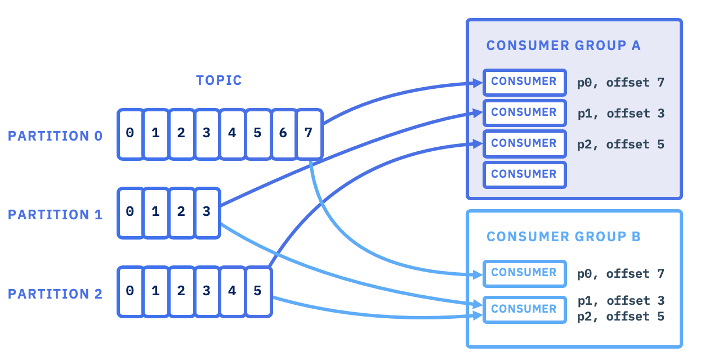
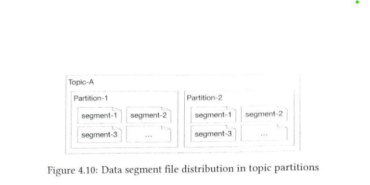
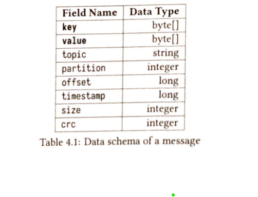

Design Distributed Message queue:

#### Message queue ( RabbitMQ ) vs Event streaming platforms ( Kafka ):

Event streaming platform are distributed message queue with extra features like have high data retention, repeated consumption of message.

***We will be discussing the message queue which have all these features. Since its not like designing question. Its a learning so will share how these works***

### Content

1. Messaging Models. ✅
   1. Point-to-Point. ✅
   2. Publish-Subscribe. ✅
2. Topic, Partitions and Brokers. ✅
3. Consumer Groups. ✅
4. High level design. ✅
5. Design deep dive. 
   1. Data storage ✅
   2. Message data structure.✅ 
   3. Batching ✅
   4. Push/Pull Method.✅ 
   5. Consumer Re-balancing [ ***Skipping*** ]
   6. State storage, metadata storage and zookeeper. 
   7. Replication and in-sync replica. 
   8. Data delivery semantics.

#### Note we guarantee the order in partition level of a topic.

#### Message Models

1. Point-to-Point: One message consumed by only one consumer. [ SQS ].
2. Publish-Subscribe: Consumer subscribe for a particular topic and consume message from it. But point-to-point can also be simulated by ***consumer group***.

#### Topic , Partition, Brokers

1. Topic: You can assume its like one queue, and we have separate queue according to topic name. So that consumer no need to listen events from other domain.
2. Brokers: These are the service which maintaining and processing your data.
3. Partition: For scaling topic and fault tolerance, we distribute the message in multiple brokers in multiple partition. So if we have lots of events in particular topic we can scale it. Partitions have different messages for a particular topic.

#### Consumer Groups

As said messaging queue allow one message to only one consumer. [ we have both feature this one as well as multiple ].
Multiple is easy , many consumer can subscribe same topic that's it.

But How to implement this ? 

That's where consumer groups come into picture.

***As name , consumer groups are the collection of consumers, one consumer can only be in one group. Messages in a partition will be consumed by only one consumer in a group but consumer can consume from multiple partition of different topic or same topic. This is like point to point model.***

#### High level design

Let's discuss about storage and coordination service in brief.

1. Data Storage
   1. State storage: keep the configuration or state of consumers
   2. Metadata storage: keep the configuration and properties of topic.
   3. Data storage: use to retain the messages

2. Coordination service
   1. Service discovery: which broker are alive.
   2. Leader Selection: Select one active controller among the brokers which will handle the partition things.
   3. Apache Zookeeper: commonly use to elect a controller.

### Deep-dive High level design

#### 1. Data storage:

Options: Sql, Nosql, Files.

Let's find out traffic pattern first :-

- Read and Write heavy.
- High data retention.
- Sequential access of data.
- No delete or update operations.

Quoting:

Database can handle the storage requirements. But they ain't ideal because it is hard to design a database that supports both write-heavy and read-heavy access patterns at a large scale.

Used Solution:

***Write Ahead Log ( WAL )*** : Its a plain file where new entries are appended to ***append-only*** log

Further Reading: 

- https://www.youtube.com/watch?v=uHvR7nOu5m4
- https://martinfowler.com/articles/patterns-of-distributed-systems/write-ahead-log.html
- https://www.freecodecamp.org/news/design-patterns-for-distributed-systems/#write-ahead-log-pattern

2. Other state and metadata can be in cache and nosql

#### 2. Message structure

Key is used to find the partition. And other field have their meaning as their name.

#### 3. Batching

This is way to improve the performance.

Batching: -> instead of calling immediately after we get event. We try to batch and make bulk call that will improve performance.

This can be improved:

1. Producer level -> instead of sending message one by one send in batch.
2. Logging level -> instead of immediately add message log write in batch. etc

Cons: Its trade off between latency and performance.

#### 4. Push/Pull

In publish-subscribe model.

We have two ways.

1. Either broker itself call each consumer like SNS who are subscribed to particular topic. [ ``Push``].
   1. Pros:
      1. Low latency: immediate push.
   2. Cons:
      1. It can result in bombard if consumer has less consumption rate than events.
2. Either consume continuously poll the events from broker. [`Pull`]
   1. Pros:
      1. Consumer control the rates.
      2. Best suitable for batch processing
   2. Cons:
      1. Checking event where there is no messages.

Mostly messaging queue implemented with pull.

#### 5. State storage, metadata storage and zookeeper.

#### 6. Replication and in-sync replica.

#### 7. Data delivery semantics.
   
   

Reference:
1. System design alex xu.
