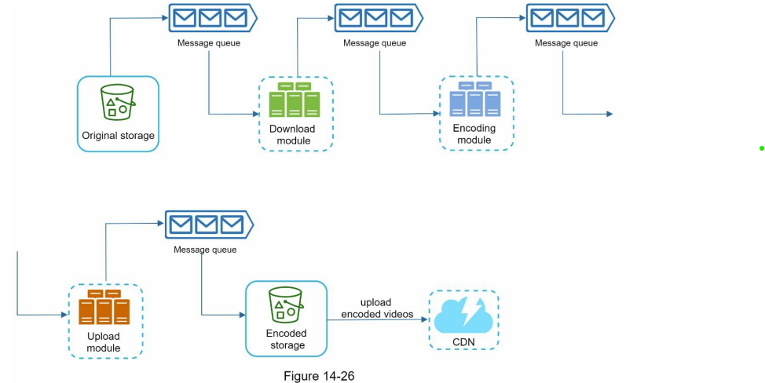
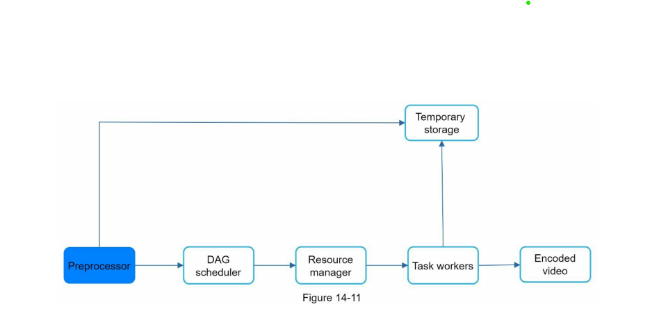
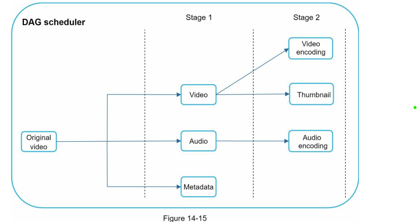
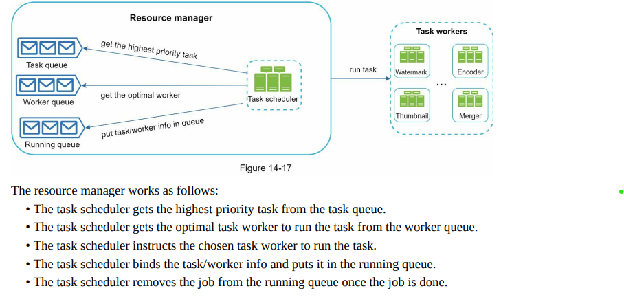

## Design youtube 

### Functional Requirements
1. Ability to upload video fast.
2. Ability to fast video stream ( no live stream simple video stream ).
3. Ability to change quality.

### Non-Functional Requirements
1. Low infrastructure cost.
2. Highly available and scalable.

### Capacity Estimation

- Assume
- 5 million DAU
- DAU watches 5 video upload them.
- 10% of them updated 1 video
- Assume average size of video upload is 300 MB
- So per second -> 50 DAU/second
- Storage per second -> 50 * 0.1 * 300 -> 1.5 GB / second or 150 TB / day.
- etc.

### High level design

So there are two major flow:

1. Streaming video: This can be done by cache. [CDN`] for some pages. If they still need then will have to fetch from our object storage
2. Other apis. this will go to api servers.
3. Video uploading: for this again we will contact api servers but including object storage.

We are more interested in video stream and uploading part. 

#### Video uploading:

- So video uploading is like putting mp4 or video file on our service. But how our database hasn't been made for this.
- Here's comes the object storage like S3 ( Design this is a separate problem , but were we are using this.).
- So what we can do , from frontend itself directly start uploading the video on S3. Once its done we will internaly send the information about the s3 url or details of the video to the api servers that will save these information in db.

#### Video streaming:

- Fetching data from s3 everytime would be much efficient , better is to keep CDN for this and that will internally connect with s3. [ Note: CDN also incur cost. ]. Streaming protocol e.g. MPEG-DASH , Adove HTTPS dynamic stream etc. ( HDS ).
- Fetch complete video in one go would be inefficient , its better to break into the chunk of videos. 

This is how on high level video uploading and stream look like

### Deep-dive high level design

- How cdn getting updated ?
- How we are getting chunks of video ?  
- do we any way to save data while saving video. ? 
- What about different video quality ? 

So more or less we want to little bit deep dive on these part. i.e. Much of video processing.

let's zoom out communication between s3 and CDN.

So Now instead of saving metadata of video via brower. We will save it by backend asynchronously. Since initially we wan't have about video complete information after chunking format etc. Also we don't immediately need this information.

1. upload video to s3.
2. that will be moved to transcoding.
3. ``this will chunk the video of each quality`` [ performance can be increase if client sent the chunk of video and object storage save it . So transcoding won't do that] and put in another storage. lets say transcoded storage
4. this transcoded storage will connect to CDN which have video in different quality with chunkings + their thumbnail, watermark etc things.
5. And there would be workers , which will update the meta infomation of video after transcoding completion.
6. We can improve performance by making each thing asynchronously , this will decouple the micro system and can scale them independently. Below if pic that have increase more parallism by distributing responsibility to individuals.

Video Transcoding itself a complex system. won't discuss it much . We can take it up separately.

Video Transcoding Responsibilities:

1. Reduce size of video.
2. Have different quality format of chunks of videos.
3. Merging other information like thumbnail etc.

- It is divided into these parts.

1. Pre-processor
   1. Storge the temporary segmented chunks.
   2. Chunks the video ( if client is not doing ).
   2. Generate DAG config.
2. DAG ( Airflow )
   1. Put the task of different part of video after breaking in video , audio etc. in task queue.
      
3. Resource manager
   1. It manages all the resource efficiently and help to allocate resource and trigger the worker according to the tasks.
   2. It contain the three queue and task scheduler.
   
   
4. Workers
   1. Executing the actual task as shown above.
   2. This is also connected to the temporary storage that helps in dealing at particular chunk and merge all task.
5. Encoded video:
   1. It is the final out put . video_chunk_1.mp4

#### References:
1. Alex xu volume 1

#### Doubts:

1. what's the protocol used for uploading video ? since it will be long process and how do we do chunking ? First flow from ui to s3.
- https, we create the chunk of file on frontend and upload on s3 with differen paths , and these according these path we fetch at the time of stream.
2. How are we getting the chunks of video from CDN ?
- it depends on the path every time we send the query according to timeline and we get that chunk only from cloudfront or from s3.
- For e.g. below is list of request for chunk. 

3. protocol for video upload and video stream ?
- upload: simply https, steam: already mentioned hds, etc.

Follow up:
- Add live-streaming
- Doubts
  
 