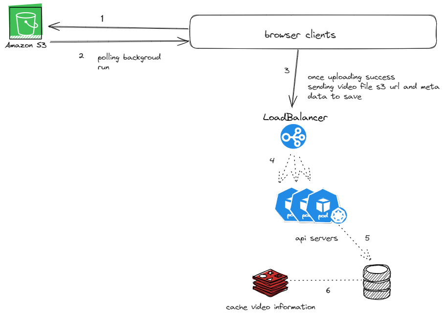

## Design youtube 

### Functional Requirements
1. Ability to upload video fast.
2. Ability to fast video stream ( no live stream simple video stream ).
3. Ability to change quality.

### Non-Functional Requirements
1. Low infrastructure cost.
2. Highly available and scalable.

### Capacity Estimation

- Assume
- 5 million DAU
- DAU watches 5 video upload them.
- 10% of them updated 1 video
- Assume average size of video upload is 300 MB
- So per second -> 50 DAU/second
- Storage per second -> 50 * 0.1 * 300 -> 1.5 GB / second or 150 TB / day.
- etc.

### High level design

So there are two major flow:

1. Streaming video: This can be done by cache. [CDN`] for some pages. If they still need then will have to fetch from our object storage
2. Other apis. this will go to api servers.
3. Video uploading: for this again we will contact api servers but including object storage.

We are more interested in video stream and uploading part. 

#### Video uploading:

- So video uploading is like putting mp4 or video file on our service. But how our database hasn't been made for this.
- Here's comes the object storage like S3 ( Design this is a separate problem , but were we are using this.).
- So what we can do , from frontend itself directly start uploading the video on S3. Once its done we will internaly send the information about the s3 url or details of the video to the api servers that will save these information in db.

#### Video streaming:

- Fetching data from s3 everytime would be much efficient , better is to keep CDN for this and that will internally connect with s3. [ Note: CDN increase our infrastructure price ].
- Fetch complete video in one go would be inefficient , its better to break into the chunk of videos. 

This is how on high level video uploading and stream look like

### Deep-dive high level design

References:

1. Alex xu volume 1

Follow up:
- Add live-streaming